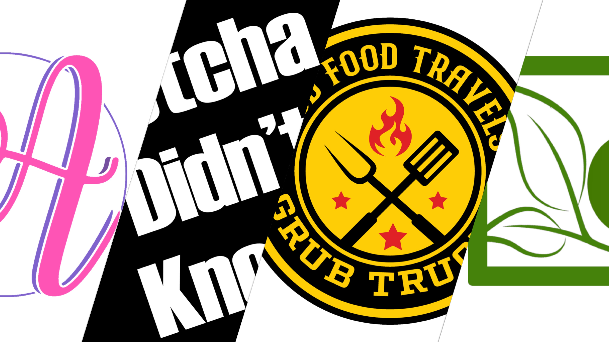

  

# WEBDMG

**WEBDMG LLC** develops digital solutions across mobile, web, and cloud platforms.  
Our work spans consumer apps, media infrastructure, and community engagement tools.  

---

## 📂 Key Projects
- **GrubTrucks** – Cross-platform food truck discovery app (iOS, Android) with subscriptions, schedules, and notifications.  
- **Amari Ari** – Educational content, puzzles, and branded merchandise ([amariari.com](https://amariari.com)).  
- **Good Food Travels** – Event management and promotion tools for food truck rallies and community events.  
- **PlayMe Platform** – Media APIs and Dockerized services for audio/video streaming.  

---

## 🛠️ Technology
- **Mobile:** SwiftUI, Kotlin, Firebase  
- **Backend:** PHP (CodeIgniter), Node.js, Firestore, MySQL  
- **Infrastructure:** Docker, AWS, GitHub Actions  

---

## 📫 Contact
- 🌐 [webdmg.com](http://webdmg.com)  
- 📧 info@webdmg.com  
- 📱 [grubtrucks.info](https://grubtrucks.info)  